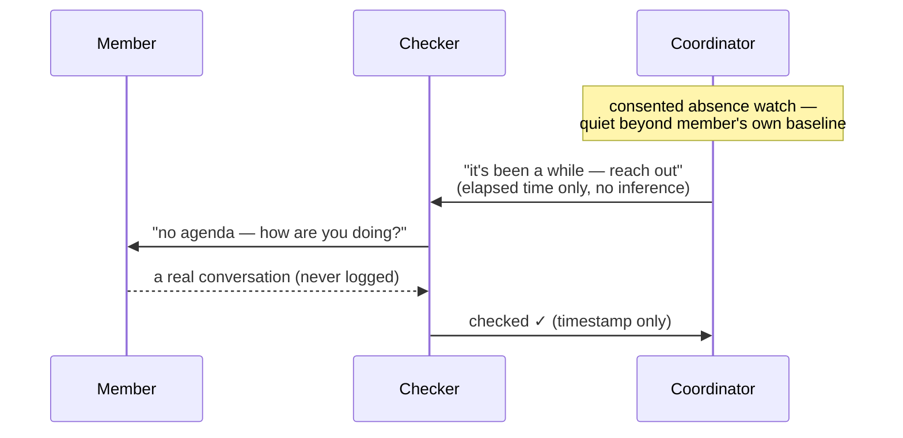

# Rooting the Social Graph with Personal Network Applications

### The Social Network Health Project

<div class="flex items-center justify-center gap-3 mt-10">
  
  <div class="text-left leading-tight">
    <div>Rich Bodo</div>
    <div class="text-sm opacity-70">DWeb Camp Berlin 2026 · Hackers Lab</div>
  </div>
</div>

<div class="text-sm opacity-70 mt-6">
socialnetwork.health · talk ~20 min, then we work
</div>

<!--
Format note up front: ~20 min of talk, then workshop. I'll gauge interest and zip
through slides — interrupt early, collaboration is the point.
-->

---

# 1 · Me

<div class="grid grid-cols-[1fr_180px] gap-6 items-start">
<div>

- Sysadmin, developer, manager — '80s through 2010s
- Early decentralized research with **Mozilla** and the **World Food Programme**
- Always an entrepreneur — no big exits — pro-bono help for a half-dozen startups and impact orgs a month
- Pandemic years: learned from a U of R trainer → recognized **social network health** as my highest-impact research area
- DWeb 2024: presented learnings — asked if software could help. *Didn't think so.*

</div>
<div>


</div>
</div>

<!--
30 seconds. The arc that matters: decades of building, then a pivot to social
network health as the highest-leverage thing I could work on. End on the 2024
answer — "no, software can't help" — because slide 2 is where that changes.
-->

---

# 2 · Help-Seeking Impedance

- Changed my tune when **I needed help myself**
- Even a *small* impedance to help-seeking can be too great at times
- Taking the data offline helps — but relationship data is **as sensitive as it gets** for an individual
- I want my communities to seek help **without impedance** — and we need a safe way to do that *outside of SaaS*
- Starting where I am: my egocentric network, building for that group only
- Assumption: people will build for themselves with AI — so I tooled up for that, too

<!--
The founding personal moment of the project. Help-seeking is critical; the data
that supports it is maximally sensitive; SaaS is the wrong home for it.
-->

---

# 3 · Home-Cooked Meals

- **2025:** built generic local-first software to compete with centralized — *not useful*
- **This year:** home-cooked meals for the egocentric graph — *that works*, and it opens up possibilities

<div class="grid grid-cols-2 gap-4 items-start mt-2">
<div>


<div class="text-xs opacity-60 mt-1 text-center"><strong>Exit:</strong> orgs shut down, or we leave — a snapshot of directory data, out of SaaS. I'm more connected; so are many others.</div>

</div>
<div>


<div class="text-xs opacity-60 mt-1 text-center"><strong>Interop:</strong> PRM — my tool, also made for one other DWeb camper.</div>

</div>
</div>

<!--
Two concrete examples carry the slide: fellows_local_db (exit) and PRM (interop).
Generic tools failed; software cooked for specific people works.
-->

---

# 4 · Social Network Health — Project Structure

<div class="grid grid-cols-3 gap-6 mt-10">
<div class="border border-gray-300 rounded-lg p-5 bg-white shadow">

### 🛡️ Data Safety

**PNA Toolkit**

spec · contracts · conformance · reference designs

</div>
<div class="border border-gray-300 rounded-lg p-5 bg-white shadow">

### 📚 Education

**SNHDB** · Wiki · Videos

research library, integrated and updated

</div>
<div class="border border-gray-300 rounded-lg p-5 bg-white shadow">

### 🔬 Research

**Forward-looking protocols**

check-in · notification · measurement

</div>
</div>

<!--
The map for the rest of the talk: slides 6–14 are the Data Safety column,
16–18 are the Research column, 19 demos the Education column.
-->

---

# 5 · Definitions

<div class="grid grid-cols-2 gap-6 items-start mt-4">
<div>


<div class="text-sm mt-2 text-center"><strong>Egocentric graph</strong> — you, your direct ties, and what <em>you know</em> about who knows whom (dotted)</div>

</div>
<div>


<div class="text-sm mt-2 text-center"><strong>Community sociograph</strong> — the whole community's tie structure, from a real study</div>

</div>
</div>

<div class="mt-4 text-sm"><strong>Ecological validity</strong> — findings that hold in real communities, not just in the lab</div>

<!--
Three terms the rest of the talk leans on. The images rhyme: the egocentric
graph is the fragment each of us can safely hold; the sociograph is what
communities want to understand.

Egocentric graph: green ego, blue solid ego→alter ties, dotted alter–alter
ties — the point to make out loud: ego users DO hold who-knows-whom info.

Sociograph: panel A cropped from the four-panel figure used in the 2024 talk —
Rich believes it's from a Peter Wyman paper. TODO: confirm the citation before
the talk and add it to this caption (red nodes = intervention peer leaders?).
-->


---

# 6 · Data Safety: The PNA Toolkit — Four Goals, Plainly

<div class="grid grid-cols-2 gap-6 items-start">
<div>

1. **Your people stay on your own device** — your contacts and private notes live with you, whatever happens to any online account
2. **You can check that it's telling the truth** — you (or someone helping you) can confirm the app does what it promises
3. **Nothing leaves without you** — nothing goes out unless you choose it, understand the risk, and see exactly what's sent
4. **You won't lose it** — your private notes survive new phones, browser clean-ups, and app updates

</div>
<div>


<div class="text-xs opacity-60 mt-1 text-center">Goal 3 in the flesh — the consent gate before a cloud AI connects</div>

</div>
</div>

<!--
Verbatim from the toolkit's plain-language explainer
(personal_network_toolkit/docs/plain-language/four-goals-in-plain-language.md).
Every promise has a named commitment behind it in the spec — that's slide 7–8.
-->

---
layout: center
---

# 7 · Data Safety: The Layers


<div class="text-xs opacity-60 mt-1 text-center">The dividing test: does it survive a total technology swap? (PNA Spec § How the pieces fit together)</div>

<!--
One sentence per layer: Goals = the why (the four you just saw).
ACs = the what — checkable promises with stable IDs, the unit of conformance.
Realizations = the how on ONE stack — no IDs, doesn't survive the swap.
Worked example if asked: AC-11 "one writer at a time" → OPFS worker on browser,
file-lock on native. One commitment, two realizations.
-->

---

# 8 · Data Safety: Commitments & Reference Designs

<div class="grid grid-cols-2 gap-8 items-start mt-4">
<div>

### Architectural commitments

- **Checkable promises with stable IDs** (`AC-1`, `AC-19`, …) — the unit of conformance
- Technology-independent: each survives a total technology swap
- Every typed contract names the AC(s) it realizes; a design attests **AC by AC**

</div>
<div>

### Reference designs

- **fellows_local_db** — ✅ complete, in use · 515 fellows, local-only
- **PRM** — 🔨 in progress · personal relationship manager on fixture data
- They prove the constraints are **livable** — made *for* specific people, rapidly

</div>
</div>

<!--
Rough shape only — don't go deep. ACs: "checked, not awarded." Reference designs
feed back into the spec: every safety question they forced is now a commitment.
-->

---

# 9 · Why Home-Cooked Local-First

- **Safety** — personal data never leaves local user control without full understanding and permission
- **Usability** — scale it down to *one person* and near-perfect feedback and customization become possible. Feedback drives everything.
- **Simplicity** — a home to protect your data and analyze threats will always be needed; adding complexity there doesn't help. Restrict functionality. The complexity of sync, auth, and sharing is **offloaded** — credible interop is often simpler than that.

<!--
The three-word version: safety, usability, simplicity. The simplicity point is
the contrarian one — we don't solve sync/auth/sharing, we offload them, and
credible interop turns out to be simpler than the machinery we skipped.
-->

---

# 10 · Exit or Interop?

<div class="grid grid-cols-2 gap-6 items-center">
<div>

- This is a **Facebook contact-data export**
- They give you **names — and nothing else**: no email, no phone, no URL, no id
- Self-evidently not fully-fleshed-out contact data
- Do we need to *sync* with them? Or just **export it and build locally** — take control and flesh it out ourselves

</div>
<div>

<div class="text-xs font-mono bg-gray-100 border border-gray-300 border-b-0 rounded-t-lg px-3 py-1.5 opacity-80">your_friends.json — Facebook "Download Your Information"</div>

```json
{
  "friends": [
    { "name": "Ada Lovelace",  "timestamp": 1576022400 },
    { "name": "John Doe",      "timestamp": 1645392000 },
    { "name": "Jane Smith",    "timestamp": 1678915200 },
    { "name": "José Ñoño",     "timestamp": 1597017600 },
    { "name": "田中 太郎",      "timestamp": 1612137600 },
    { "name": "Mary O'Brien",  "timestamp": 1500000000 }
  ]
}
```

<div class="text-xs opacity-60 mt-1 text-center">That's the whole record. Every field of it.</div>

</div>
</div>

<!--
Synthetic fixture mirroring the real DYI shape — prm/tests/fixtures/facebook/
(no real export is committed there; the README documents the real thing:
"Almost nothing… no URL, no email, no phone, no id — the weakest source the
ingester handles and the canonical no-identifier case.")

If asked about the timestamp: it's the connected-on date, epoch seconds — the
ONE piece of relationship metadata they give you. Bonus detail for a hacker
audience: real exports ship José as "José" (UTF-8 decoded as latin-1) — they
can't even get the names right. And this thin list still matters: it's the
seed of a friend-reconciliation checklist — knowing WHO is in the network and
where they came from is the start of reclaiming the root.
-->

---

# 11 · Methodology

<div class="grid grid-cols-[1.3fr_1fr] gap-6 items-start">
<div>

- **Conformance as discipline** — crazy to do in 2025; now it's crazy *not* to. Build context and test constantly.
- **Threat modelling & positioning** — we can afford to refresh these *often* now
- **Encourage user-development** — skills ship with tools; spec versions ship with the toolkit
- **Education is central** — users need to know what they're getting into (AI, OS automation…). We need to know what we're doing: a research library is integrated and updated for devs — *and users will be devs*

</div>
<div>


<div class="text-xs opacity-60 mt-1 text-center">fellows_local_db conformance report — evidence-linked</div>

</div>
</div>

<!--
The LLM-era shift in one line: continuous conformance and frequent threat-model
refreshes used to be unaffordable; now they're the cheapest discipline we have.
-->

---

# 12 · Methodology Finding: Usability *Is* User Safety

- Users won't use an app they consider unusable — **exceptions to safety are the reality**
- So: develop **countermeasures** and deal with it — this improves the toolkit *and* the spec (the AI exceptions)
- Keep building **with users** — External Access Handling came from exactly this
- And the payoff: users actually *use* the app — **so they can seek help more easily**

<div class="grid grid-cols-2 gap-4 items-start mt-2">
<div>


<div class="text-xs opacity-60 mt-1 text-center">The app tells you it has left local-only mode</div>

</div>
<div>


<div class="text-xs opacity-60 mt-1 text-center">PRM External Access — banner, data floor, revoke, return to PNA mode</div>

</div>
</div>

<!--
The finding, not the wish: perfect lockdown loses the user, and a lost user is
the least safe outcome of all. Named, visible, reversible exceptions instead.
-->

---

# 13 · The AI Exception: What We Had to Build

<div class="text-center italic text-lg my-3">"Honesty scales; purity doesn't."</div>

<div class="grid grid-cols-2 gap-x-8 gap-y-1 text-sm">
<div>

- **Consent gate, fail-closed** — a human action on a surface the app controls; named risks, scroll-to-enable
- **Sealed by default / data-floor** — every field unreadable until *you* mark it shareable; the most sensitive never reach the AI surface
- **Surface minimization** — the cloud-facing surface exposes only the tools the task needs
- **Blast-radius preview** — which fields × how many contacts, *before* you consent
- **Mode banners** — amber "local AI on" (with its honest caveat) · red **"Not a PNA right now"**

</div>
<div>

- **Per-read approval** — each AI read held for your Approve / Deny, per contact
- **Exceptions ledger** — every grant itemized: which contact, which fields, when approved, when last read — each with its own **Revoke**
- **Return to PNA mode** — one action drops every grant; the next read is withheld
- **Staged writes** — the AI proposes; a human commits. *No promote tool exists on the AI surface*
- **Honest non-claims** — sent data can't be recalled; the consuming model can't be identified. The UI says so.

</div>
</div>

<div class="text-sm opacity-80 border-l-4 border-[#f7c948] pl-3 mt-4 italic">
"The surest way to fail at protecting data is to ship a tool too pure to use. The fellows users demanded a cloud LLM. … In return it provides real productivity. <strong>That is the equation.</strong>"
</div>

<!--
The union of what fellows_local_db and PRM actually built to make EX-CLOUD-LLM
viable. The fundamental thing: the user always understands what's happening
with their data — every row above is a way of making that true.

Quotes: PNT docs/design-notes/2026-06-exceptions-existential-review.md (via the
key-insights compilation). Full context for "honesty scales": prohibition is
architecturally unenforceable (MCP can't identify the consuming LLM), so the
real choice is governed vs. ungoverned egress — an unverifiable guarantee is
worth less than an honest, bounded one.

Sources for the list: PNT spec/exceptions.md § Countermeasure library;
prm docs/explainers/ai-reads-and-writes-walkthrough.md (semantics tables);
fellows consent gate + private_data_ops surface minimization.

DEMO HOOK: if people want it, show the countermeasure integration live in PRM —
grant → banners → per-read queue → ledger → revoke → return to PNA mode.

(This slide fills the number skipped in notes_pre_berlin.md — the AI-exception
countermeasures expansion of slide 12, per Rich 2026-07-10.)
-->


---

# 14 · Methodology Finding: Ongoing Processes

- **Positioning updates found siblings from other eras** — the survey isn't a one-time artifact; refreshing it keeps surfacing kin projects
- **Validating other apps improves the spec** — running the three layers against *Signal* sharpened the commitments

<!--
Both findings argue the same point: positioning and validation are PROCESSES,
not documents. Each refresh pays back into the spec.
-->

---

# 15 · A Longer-Term Plan

<div class="text-sm opacity-70 mb-4">Presented here first.</div>

1. **A safe place for human relationship data** — validated tools that bring contact & relationship data local, so we can interact outside SaaS with confidence. Start with the simplest things that work: *home-cooked meals.*
2. **Egocentric analysis** — validated tools that bring *communications* data local, to understand our egocentric networks and act to improve outcomes within them
3. **Sociocentric analysis & interaction** — validated *protocols* that may let remote communities practice what was once only local, practitioner-guided work. Advanced tech enters here — **research teams included before interventions.**

<!--
FULL TEXT (compressed off the slide):

Social network health research tells us how great outcomes for everyone in our
communities are correlated. Education, interaction, and skill building are
infinitely more important than "underlying tech" — the best of which is inbuilt
in us. Remote, digitally connected communities cannot escape some tech, though.
So we have a plan:

Step 1: A safe place for human relationship data. Develop and validate safe
tools that bring our contact and relationship data local — allowing us to
interact outside of SaaS with confidence — even with the most sensitive
information. Start with the simplest things that work — home cooked meals.

Step 2: Egocentric analysis. Develop and validate safe tools that bring our
communications data local — allowing us to understand our egocentric networks
more fully, and act on that information to improve outcomes within them.

Step 3: Sociocentric analysis and interaction. Develop and validate safe
protocols that may allow remote communities to practice what has previously
been the domain only of local communities enhanced by experienced practitioners
working with the latest research in social network health. This is where the
advanced tech comes in, and research teams need to be included before
interventions. If viable, could launch initiatives far beyond the creation of
home-cooked software meals.
-->

---

# 16 · Notification Protocol — Connection Requests with Staged Disclosure

<div class="grid grid-cols-[1fr_1.1fr] gap-8 items-start text-sm">
<div>

*One-button help-seeking — disclosing as little as possible, to as few as possible, at every step.* **Staged disclosure is the friction reduction.**

**Actors**

- **Requester** — the person seeking a 1:1
- **Responder** — an audience member who answers a ping
- **Audience** — *any addressable set of helpers*: a PRM tag group ↔ a **super contact**
- **Coordinator** — holds staged state, matches while both sides stay blinded
- **Steward** — accountable human: proposes the super contact, operates the coordinator

**Beyond the egocentric network** — threat catalog RF1/K1: *those who most need help have the weakest ego networks*. So a whole community becomes addressable as one **super contact** — only by its own **opt-in ceremony**.

</div>
<div>

<div class="flex flex-col gap-1.5 text-xs">
  <div class="border border-gray-300 rounded-lg px-3 py-1.5 bg-white shadow-sm"><strong class="text-[#2179b8]">S0 · Compose</strong> (local) — audience · coarse topic · time window. <span class="opacity-60">Nothing leaves the device.</span></div>
  <div class="text-center opacity-40 leading-none">↓</div>
  <div class="border border-gray-300 rounded-lg px-3 py-1.5 bg-white shadow-sm"><strong class="text-[#2179b8]">S1 · Availability ping</strong> — "someone would like a 1:1, window X." <span class="opacity-60">No topic, no identity.</span></div>
  <div class="text-center opacity-40 leading-none">↓</div>
  <div class="border border-gray-300 rounded-lg px-3 py-1.5 bg-white shadow-sm"><strong class="text-[#2179b8]">S2 · Topic gate</strong> — coarse topic → <em>available responders only</em>. <span class="opacity-60">The wider audience never learns it.</span></div>
  <div class="text-center opacity-40 leading-none">↓</div>
  <div class="border border-gray-300 rounded-lg px-3 py-1.5 bg-white shadow-sm"><strong class="text-[#2179b8]">S3 · Match + mutual consent</strong> — identities cross only now. <span class="opacity-60">Reveal mode is a per-audience policy knob.</span></div>
  <div class="text-center opacity-40 leading-none">↓</div>
  <div class="border border-gray-300 rounded-lg px-3 py-1.5 bg-white shadow-sm"><strong class="text-[#2179b8]">S4 · Close-out</strong> — warm thanks to the unchosen · no-match → <strong>pre-generated fallbacks, local</strong>.</div>
</div>

<div class="text-xs opacity-60 mt-2 text-center italic">"The fallback path is entirely local — zero privacy cost at the moment of maximum vulnerability."</div>

</div>
</div>

<!--
Source: research/protocols/notification-protocol.md v0.2 (Opportunity 2 in the
talk description; July 4 grill).

The thesis chain: help-seeking friction is mostly DISCLOSURE risk — who finds
out I need help, and what do they learn? Staging the disclosure is what makes
one button safe to press. Each stage's "who learns what" is the design.

Super contact details if asked: a 100-person Signal group addressable as ONE
contact. Steward proposes; the group consents through its own mechanisms
(vote, objection window); the coordinator bot is visible and ejectable; members
can mute or opt out; a member's PRM stores only the handle and steward — never
the roster. Nobody can unilaterally make a group addressable. Egocentric asks =
ordinary communication risk; super-contact asks = the danger zone, full staged
machinery + the full step-3 gate.

S3 reveal policies: anonymous cards / names at S3 / coordinator auto-match —
set per-audience at the opt-in ceremony.

Failure semantics: mandatory TTL; coarse outcome only (matched / no match — no
counts; a zero reads as personal rejection, G1); escalation offered, never
automatic. Ephemeral by default — coordinator purges at S4, aggregate counters
only.

Attack duals (slide-20 fodder): predatory responder (S3 learns identity of a
by-construction vulnerable person) ↔ harvesting requester (farms S2 yeses;
consent at S3 can't retroactively protect S2 — so responses flow only to the
coordinator, rate limits, aggregate audit). V1 substrate: steward-operated bot
+ private GitHub repo carrying encrypted artifacts — named trust, degradation
table in the note.
-->

---

# 17 · Check-in Protocol — Proactive Peer Check-ins

<div class="grid grid-cols-[1fr_1.1fr] gap-8 items-start text-sm">
<div>

*A help-seeking button cannot reach someone who has stopped reaching.*

**Actors**

- **Member** — anyone in the community
- **Checker** — *named by the member* (the phone tree); nobody is assigned one
- **Steward** — accountable human; receives escalations, owns the crisis-resource list
- **Coordinator** — optional software; holds pairings + timestamps, **never content**

**Stages** — least risky first, each gates the next

1. Human-human **cadence** check-ins (no software)
2. **Triggered** — absence / acute events, consented signals
3. **Escalation** paths, steward duties, duty-of-care review

</div>
<div>



<div class="text-xs opacity-60 text-center">Stage 2, success case — the nudge carries no inference; content never touches the system</div>

</div>
</div>

<div class="text-xs mt-2 opacity-80">Not a cron job — every choice is research-consulted: top-down checker assignment overlaps only <strong>13–23%</strong> with network-optimal picks; members naming their own is the program primitive (Pickering, Wyman et al. 2022; Wyman 2010/2019).</div>

<!--
Source: research/protocols/checkin_protocol.md v0.1.1 (idea-stage; grill before v0.2).

Origin (say it with care): the project's memoriams postvention practice — losses
among open-source contributors. Two recurring facts: radio silence was the only
warning signal, and the last contacts were purely technical — bandwidth for code
review, none for human review.

Why research-consulted, not a cron job:
- Bond-building causally reduces suicidal ideation/depression, mediated by
  cohesion (Wingman-Connect RCT, Wyman 2020) — Stage 1 IS the mechanism.
- Isolation from adults/mentors marks the vulnerable (Wyman 2019, 38 schools).
- Members name their checkers because top-down selection measurably misses
  (Pickering/Wyman/Valente 2022: 13–23% overlap with network-optimal).
- Cadence exists for NORMALIZATION: a check-in that only arrives when someone
  seems off is an alarm, not a relationship.

Hard constraints if asked: opt-in both sides; no content logging; no inference,
scoring, or risk ranking, ever; right to silence — declining contact never
triggers escalation. Escalation is two rungs of checker judgment: steward
(fact-of-concern only) or crisis resources. The promise is contact, not rescue.

Stage-2 endgame: the measurement protocol's encrypted space IS the coordinator —
baselines and elapsed-time computed inside the privacy boundary; the only output
is the nudge, released only to the member's chosen checkers (ties to slide 18).
-->


---

# 18 · Community Network Health from Encrypted Egocentric Data

<div class="grid grid-cols-[1fr_1.1fr] gap-8 items-start text-sm">
<div>

**The theory already exists.** Smith 2012, *"Macrostructure from Microstructure"*: whole-network structure can be **estimated from egocentric samples alone** — the fragments each of us can safely hold.

- This one is a **thesis, not yet a protocol**: *these calculations can be made without anyone surrendering their graph*
- The engine is an **ERGM** — at heart, **logistic regression**: given local tendencies (clustering, homophily, sparsity), how likely is *this tie* vs. not?
- The payoff, implemented on privacy-preserving substrates: **community-level aggregate health metrics** — cohesion · reach · isolation — *with honest uncertainty ranges, never individual scores*

</div>
<div>

<div class="flex flex-col gap-1.5 text-xs">
  <div class="border border-gray-300 rounded-lg px-3 py-1.5 bg-white shadow-sm"><strong class="text-[#2e8540]">Sample</strong> — consented egocentric fragments: who-knows-whom, nothing more</div>
  <div class="text-center opacity-40 leading-none">↓</div>
  <div class="border border-gray-300 rounded-lg px-3 py-1.5 bg-white shadow-sm"><strong class="text-[#2179b8]">Fit</strong> — an ERGM via logistic regression: which tie patterns are likelier in <em>this</em> community</div>
  <div class="text-center opacity-40 leading-none">↓</div>
  <div class="border border-gray-300 rounded-lg px-3 py-1.5 bg-white shadow-sm"><strong class="text-[#2179b8]">Simulate</strong> — generate many whole networks consistent with the fitted model, scaled to the full population</div>
  <div class="text-center opacity-40 leading-none">↓</div>
  <div class="border border-gray-300 rounded-lg px-3 py-1.5 bg-white shadow-sm"><strong class="text-[#2179b8]">Quantify</strong> — the spread across those simulations → a <em>range</em>, not a false point estimate</div>
  <div class="text-center opacity-40 leading-none">↓</div>
  <div class="border border-gray-300 rounded-lg px-3 py-1.5 bg-white shadow-sm"><strong class="text-[#2e8540]">Derive</strong> — aggregate community-health metrics + uncertainty</div>
</div>

<div class="text-xs opacity-60 mt-2 text-center italic">"Gate more, model more" — privacy gating and generative reconstruction are the same coin.</div>

</div>
</div>

<!--
Source: research/measurement/community-network-health-explainer.md (+ the
egocentric→community research note). Smith 2012, Sociological Methodology —
Fit step: binary ERGM estimated from ego samples via pseudolikelihood;
Simulate step: Gibbs sampling, size-invariant so it projects to unknown N.

Verbal explanation to carry (they haven't read the paper): every tie you
withhold for privacy is a tie the analysis can't observe — which is exactly
why the fit-then-simulate step is load-bearing, not optional. The same gating
that protects privacy is what keeps you in the generative-model regime.

If depth is wanted: the reusable primitive is the PATTERN (Fit → Simulate →
Quantify → Derive), not Smith's specific estimator — the Fit step is a slot
(valued ERGMs, latent-space models for richer comms data). Validation without
ground truth = Smith's own move: calibrate on known networks first, before any
real deployment.

System integration (audience mostly lacks background — keep verbal, light):
data flows from PRMs through encrypted spaces; the analysis runs inside the
privacy boundary and only aggregate metrics + uncertainty emerge. Ties back to
slide 17: that same encrypted space can BE the check-in coordinator.

Guard rails if asked: never individual scores (threat catalog: metrics
diagnostic, never targets); small-N re-identification is why aggregates-only
and modeled release — the "two bombshells" arc from the June 9 grill.
-->

---

# 19 · Demos

- **Validation** — the conformance suite running against a real app
- **SNHDB research queries** — asking the research corpus a question, with citations
- **Paper resolver** — DOI/topic → metadata + legal open-access full text

<div class="text-sm opacity-60 mt-8">Pre-recorded video — narrated live.</div>

<!--
TODO (after the slides are done): record the demo video covering all three.
Pre-recorded so it can't fail on conference wifi. 2–3 minutes, narrated live.
-->

---

# 20 · Workshop Options

Break out. We can workshop:

- **A.** Critiques of the plan, the PNA Toolkit and spec — areas to improve
- **B.** SNHDB research queries
- **C.** Validation of *your* favorite app
- **D.** One-shot a SaaS backup app

<div class="mt-8 font-bold">…but we meet back and synthesize for the last 15 minutes.</div>

<div class="mt-10 text-sm opacity-70">
<a href="https://socialnetwork.health" target="_blank">socialnetwork.health</a> · discuss@socialnetwork.health
</div>

<!--
Split by interest, reconvene for report-backs, I capture everything into the
repo. Contact info stays up while we work.
-->
