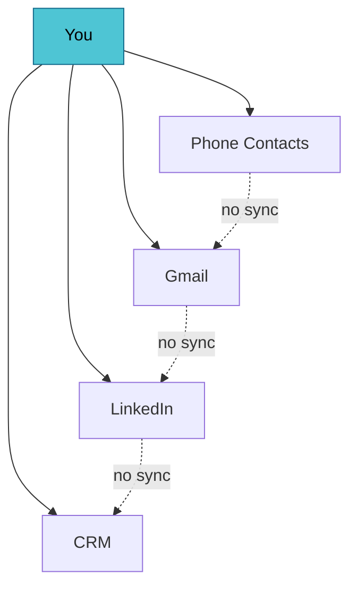

# Personal Network Toolkit

Local-first, sovereign relationship data — and the spec that makes it interop

<div class="pt-12">
  <span class="px-2 py-1 rounded bg-white bg-opacity-10">
    Press <kbd>Space</kbd> to begin <carbon:arrow-right class="inline"/>
  </span>
</div>

<!--
Speaker note: this block is the last comment on the slide, so it shows in Presenter Mode.
Intro yourself, set the frame: this is a working session, not a lecture. ~3 min.
-->

---
transition: fade-out
---

# What we'll do today

A 60-minute working session, not a lecture.

<v-clicks>

- **The problem** — why contact data is broken and who it hurts
- **PNA** — what "credible interop" and "sovereign overlay" actually mean
- **The architecture** — two-database pattern, privilege separation
- **Build something** — scaffold a local-first contact app together
- **Where it goes** — RFC path, getting involved

</v-clicks>

<br>

<v-click>

> Stop me anytime. The whole point is the conversation.

</v-click>

<!--
v-clicks reveals each bullet on a key press. Good for pacing so the room
isn't reading ahead of you. ~2 min on this slide.
-->

---
layout: two-cols
layoutClass: gap-8
---

# The problem

Your relationships live in silos you don't control.

- Phone, email, CRM, socials — each a walled garden
- No portable schema you own
- "Export" gives you a dead CSV, not a living graph
- Every app re-implements the same broken contact model

::right::

<div class="pt-14">



</div>

<!--
two-cols layout. ::right:: marks the second column.
Mermaid renders natively — no image export needed. ~4 min.
-->

---

# PNA: the core idea

<div class="grid grid-cols-2 gap-8 pt-4">

<div>

### Credible interop
Data that's portable *and* verifiable. You can move it, and the recipient can trust its provenance — without a central authority vouching for it.

</div>

<div>

### Sovereign overlay
A layer you own that sits **above** the apps. The apps become views; your data stays yours. No SaaS lock-in, no platform as landlord.

</div>

</div>

<div class="pt-8 text-center text-gray-400">
The category isn't "another address book." It's the missing substrate.
</div>

<!--
This is the conceptual heart. Don't rush. Invite pushback on the terms —
the room at DWebCamp will have opinions on "sovereignty". ~6 min.
-->

---

# The two-database pattern

```ts {all|2-5|7-10|all}
// Shared DB — read-only, comes from others
interface SharedRecord {
  source: string        // who published this
  signature: string     // verifiable provenance
}

// Private DB — read-write, yours alone
interface PrivateRecord {
  notes: string         // never leaves your device
  tags: string[]        // your schema, your rules
}
```

<v-click>

Privilege separation in the qmail / Unix tradition: each component does one thing, holds the least authority it needs.

</v-click>

<!--
The code block uses line-highlighting: |2-5| highlights those lines on the
next click, then |7-10|, then back to all. Walk the room through it. ~6 min.
-->

---
layout: center
class: text-center
---

# Let's build

Scaffold a local-first contact app — together, live

<div class="pt-8 text-gray-400">
vanilla JS · SQLite (wasm) · OPFS · no server
</div>

<!--
Switch to your terminal / editor here. This is the live-coding segment.
Budget the most time: ~20 min. Have a fallback branch ready in case wifi dies.
-->

---

# Where this goes

<div class="grid grid-cols-3 gap-4 pt-8">

<div class="p-4 rounded border border-gray-700">
<carbon:document class="text-3xl text-teal-400"/>
<h3 class="pt-2">RFC path</h3>
<p class="text-sm text-gray-400">Converting the spec into a proper RFC for review</p>
</div>

<div class="p-4 rounded border border-gray-700">
<carbon:network-3 class="text-3xl text-teal-400"/>
<h3 class="pt-2">Prior art</h3>
<p class="text-sm text-gray-400">Mapped against ~100 references — PNA as a distinct category</p>
</div>

<div class="p-4 rounded border border-gray-700">
<carbon:group class="text-3xl text-teal-400"/>
<h3 class="pt-2">Get involved</h3>
<p class="text-sm text-gray-400">Open source, never SaaS, built for handoff</p>
</div>

</div>

<!--
Land the plane. Point to the repo, the spec, how to contribute. ~6 min,
leaving buffer for overflow questions.
-->

---
layout: center
class: text-center
---

# Thank you

[Repo](https://github.com/richbodo) · questions welcome

<div class="pt-8 text-sm text-gray-400">
  Slides built with Slidev — press <kbd>o</kbd> for overview, <kbd>e</kbd> to export
</div>

<!--
Final slide. Leave it up during Q&A so people can grab the links.
-->
