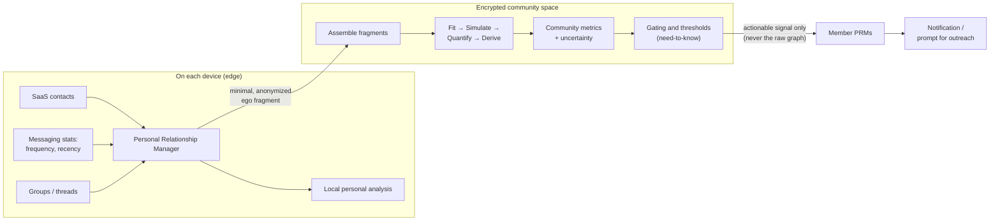
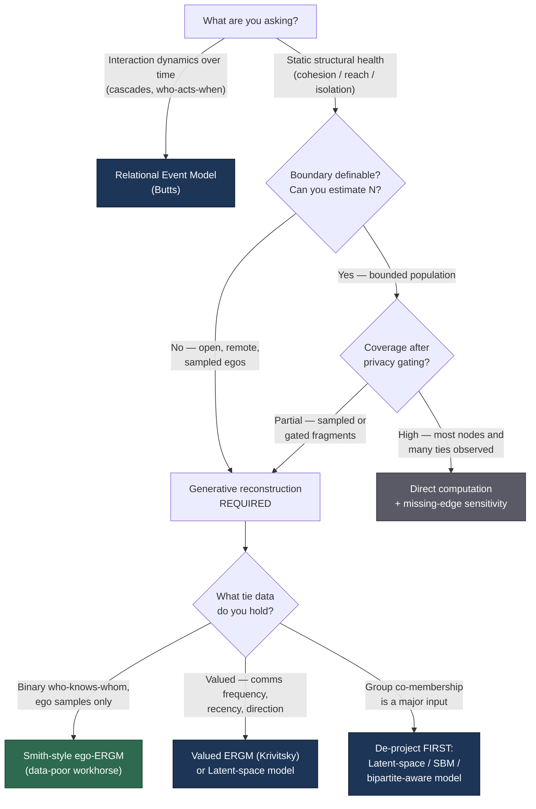

# Community Network Health from Encrypted Ego Data
### A pattern, its primitives, and a routing guide for developers

---

## The vision

Picture the system from the outside in.

Each person runs a **personal relationship manager (PRM)** — a contact manager whose source code they control. It already does the boring, valuable work: pulling contacts from SaaS address books, communication statistics (frequency, recency, direction) from messaging systems, and the groups people naturally maintain — the pickleball thread, the family WhatsApp, the Signal group for a project. All of that lives locally and is immediately useful to the individual for their own analysis. No community angle required to justify building it.

Now add a community layer **without moving anyone's raw data.** Each PRM can contribute a minimal, anonymized fragment of its owner's local graph into a shared **encrypted space** — an enclave that no single participant can read into. Inside that space, an analysis process assembles those fragments into something no individual could compute alone: an estimate of the community's whole-network structure. It never emits that structure. What it emits are **gated, actionable signals** — "the connected core is fragmenting," "these members are drifting to the edge," "this subgroup has gone quiet" — pushed back out to individual PRMs, on a need-to-know basis, to be surfaced as notifications a human can act on.

The whole-network view exists only transiently, in simulation, inside the enclave. Raw relationship data stays on the edge. Only fragments flow in; only aggregate, gated signals flow out.

---

## What we're computing (and why it's hard)

The signals come from a handful of structural metrics. Three carry most of the weight for social network health:

- **Cohesion** — is the community one connected whole, or a set of disconnected islands? Operationally: the size of the *largest connected group* (the biggest set of people who can all reach each other through some chain of ties) and the number of separate components.
- **Reach** — how many hops separate typical members? (Average path distance — the "degrees of separation.")
- **Isolation** — how many members sit alone or hang off a single thin tie? (The degree distribution, and the count of isolates and near-isolates.)

These are **sociocentric** properties — facts about the whole network. The trouble is that everything you can collect is **egocentric** — each person's own local view: themselves, their ties, and the strength of those ties. You are always trying to state sociocentric facts from egocentric data.

And you never observe the whole graph. Three forces guarantee it:

1. **Open boundaries.** Communities of digitally-connected, remote members have no clean edge — you often can't even enumerate how many people *N* are in them.
2. **Partial participation.** Not everyone contributes, ever.
3. **Privacy gating manufactures missingness — on purpose.** Even where you *could* observe a tie, you anonymize it, withhold it, or release it only need-to-know. That is not a bug to engineer around; it is the point of the system.

The consequence: structurally, you are permanently in the **partial-data regime**, no matter how rich each individual's local data is. That single fact is what makes the rest of this document necessary.

---

## The pattern: Fit → Simulate → Quantify → Derive

The response to "I can only see fragments but need whole-network facts" is a single reusable pattern:

1. **Fit** a *generative model* of how ties form in this community, using whatever partial, local data you have. (A generative model assigns a probability to *entire networks* — it encodes the tendencies, like sparsity, clustering, and homophily, that make some graphs likelier than others.)
2. **Simulate** many complete networks consistent with that fitted model, scaled up to the full (estimated) population.
3. **Quantify** uncertainty by measuring the spread of each metric across those simulated networks — you get a *range*, not a false point estimate.
4. **Derive** your community-health metrics from the simulated networks.

**Smith (2012) is one instantiation of this pattern.** Its Fit step is a binary Exponential Random Graph Model (ERGM) estimated from ego samples via pseudolikelihood; its Simulate step runs that model forward with Gibbs sampling. But the pattern itself is estimator-agnostic. **The Fit step is a slot.** What you plug into it depends on your data — and that choice is the whole engineering decision the routing diagram below resolves.

The key realization for a data-rich system like yours: richer data does not *retire* this pattern. It **unbundles** it — upgrading the Fit step dramatically while leaving the Simulate step's *necessity* untouched, because necessity is governed by coverage and boundary, not by how rich each observation is.

---

## The primitives (terminology)

**Core terms**

- **Egocentric network** — one person's local view: them, their contacts, and (ideally) which of those contacts know each other. What a survey or a PRM export reveals.
- **Sociocentric network** — the whole community graph. The thing you want but can't directly see.
- **Tie** — a relationship between two people. **Binary** (present/absent) or **valued** (weighted by strength — e.g. message frequency).
- **Alter–alter tie** — whether two of *your* contacts know each other. The signal that lets a model estimate clustering. Contact lists rarely contain it directly; comms and group data give it to you *indirectly* (see the group trap below).
- **Affiliation / group data** — co-membership in a group. Categorically *not* pairwise friendship (see below).
- **Coverage** — the fraction of nodes and pairwise ties you actually observe, *after* privacy gating.
- **Boundary definedness** — whether you can enumerate or estimate *N*, the population size.

**The menu for the Fit slot** — the estimators you route between:

- **Ego-ERGM (Smith 2012).** Binary ties, estimated from ego samples, size-invariant so it projects to an unknown *N*. The data-poor workhorse. Use when all you have is who-knows-whom fragments.
- **Missing-data ERGM (Handcock & Gile).** The general framework for fitting an ERGM to a *partially observed* network; Smith's method is a special case. Use when you observe part of a bounded graph directly.
- **Valued ERGM (Krivitsky).** Ties carry weights — counts, strengths. The natural home for communication frequency: a tie isn't just present, it's "they message daily" vs "twice a year."
- **Latent-space models (Hoff, Raftery & Handcock).** Embed each node as a point in a latent space; closer points are likelier to be tied. Handle valued and partially-observed data gracefully, and hand you node embeddings you can compute other things on. Strong fit for rich comms data.
- **Stochastic blockmodels (SBM).** Assume nodes belong to latent blocks; tie probability depends on block membership. You get community detection *and* edge prediction in one model — useful when part of the question is "what are the subgroups?"
- **Relational event models (Butts).** Model the *timestamped stream* of interactions — who contacts whom, when — rather than a static structure. A different question (dynamics, cascades), reachable because you hold message logs, but not what you use for static cohesion.

*(Attributions above are pointers to look up, not exact citations — verify before publishing.)*

---

## A warning about your richest signal: the group trap

Groups are the best new data you have and the most dangerous.

A 50-person WhatsApp group is **not** 1,225 friendships. Group co-membership is *affiliation* data, and the naive move — projecting it to a one-mode graph where everyone in a group is tied to everyone else — **fabricates cliques by construction.** It will inflate exactly the cohesion and clustering numbers you most care about, silently.

The antidote is the communication statistics you already collect: two people in a big group who never message directly are weakly tied; two who message daily are strongly tied. But note what that implies — converting *(co-membership + comms weights)* into defensible tie estimates is **itself a modeling problem.** It wants a valued, latent, or bipartite-aware model, not a counting loop.

So in the group-data case, richness doesn't remove the model — it *requires* one. This is the sharpest example of the "unbundling" claim: the data got richer, and the need for principled estimation went *up*, not down.

---

## Routing: Smith-style estimation, or something else?

Two variables decide most of it — how much of the graph you observe (**coverage**), and whether the community has a definable boundary (can you estimate **N**?). Privacy gating slides you toward the modeling side of every axis.

|                          | **High coverage**                          | **Partial coverage**                          |
|--------------------------|--------------------------------------------|-----------------------------------------------|
| **Bounded (N known)**    | Direct computation + sensitivity check     | Generative imputation (richer estimators)     |
| **Unbounded (N unknown)**| Generative extrapolation                   | Generative extrapolation (Smith-style ↔ richer)|

The fuller decision — including *what data you hold* — routes like this:

**Reading the diagram**

- **Green = Smith-style is genuinely the right tool.** You're in the data-poor corner: open boundary or partial coverage, and only binary who-knows-whom fragments. This is exactly what the 2012 method was built for, and privacy-gating keeps you here even when you technically hold more.
- **Blue = other methodology takes over.** The moment your ties are *valued* (comms weights) or your input is *group co-membership*, you've outgrown the binary ego-ERGM. You still run the same Fit → Simulate → Derive *pattern* — you've just swapped a richer estimator into the Fit slot. Temporal questions leave the static-structure family entirely and go to relational event models.
- **Grey = no model needed.** Bounded population, high coverage: just compute the metric on what you observe and stress-test the few missing edges. Smith adds nothing here; the simulation step solves a problem you no longer have.

The honest summary: in *your* setting — remote, digitally-connected, privacy-gated communities — open boundaries and deliberate gating keep you on the generative side of the diagram almost always. You need the **pattern** nearly all the time. You need Smith's **specific estimator** only in the binary, data-poor corner. The interesting engineering is building the *richer* estimator (valued / latent / bipartite-aware) that makes the same simulate-to-population step trustworthy on your comms and group data.

---

## The gating layer, and a loop worth noticing

A raw metric is not an alert. The enclave applies thresholds and policy to decide what is *actionable* and who has a *need to know*: a fragmentation trend might notify everyone; a specific member drifting toward isolation might notify only the few people positioned to reach out. The intervention is **human** — the signal is a prompt for connection, not a diagnosis.

And here is the loop that ties the whole design together: **the same gating that protects privacy is also what keeps you in the generative-model regime.** Every tie you withhold or anonymize is a tie your analysis cannot observe directly — which is exactly why the Fit → Simulate step is load-bearing rather than optional. Privacy gating and generative reconstruction are not two separate concerns; they are the same coin. *Gate more, model more.*

---

## What's still unsolved

- **Estimating N under open boundaries.** Projecting to a full population needs a size estimate or a defensible proxy; without a boundary, this is genuinely hard.
- **Uneven, gated distribution of results.** Deciding who receives which metric is a policy problem — and the gating pattern itself can leak information (differencing attacks across what different members are shown).
- **Validation without ground truth.** You can't check a reconstruction against a whole graph you never had. The only calibration path is Smith's move: run the pipeline on *known* networks first, compare simulated vs true metrics, and characterize where confidence holds — before any real deployment.
- **Turning indirect signal into alter–alter ties.** Comms and group data imply who-knows-whom, but converting them defensibly is the open group-model problem above.
- **Poisoning / Sybil resistance.** Anonymized contributed fragments are an attack surface: injected fake ties can skew community metrics. An adversarial-robustness story is required, not optional.
- **Per-community routing.** Different communities land in different cells of the diagram. The system may need to *route dynamically* rather than commit to one estimator globally.

---

*The takeaway in one line: the reusable primitive is not "Smith 2012" — it is the pattern **Fit → Simulate → Quantify → Derive**. Smith is its survey-era instantiation; your job is to build the rich-data instantiation, and the routing diagram tells you which estimator that is for any given community.*
